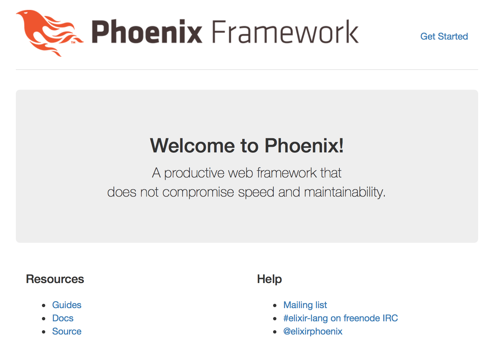

# Phoenix 初体验

在[前一章](01-create-project.md)，我们创建了 `Menu` 项目。现在，让我们进入项目的根目录，启动服务器：

```bash
$ cd menu
$ mix phx.server
```
打开浏览器，访问 [http://localhost:4000](http://localhost:4000) 网址，我们会看到如下截图所示的内容：



从输入网址到返回页面之间，都发生了什么？我们来简单了解一下。

1. 我们在浏览器访问 `http://localhost:4000` 网址
2. Phoenix 在服务器端接收到请求，它会检查 `menu` 目录下的 `lib/menu_web/router.ex` 文件，然后定位到如下内容：

    ```elixir
    scope "/", MenuWeb do
        pipe_through :browser # Use the default browser stack

        get "/", PageController, :index
    end
    ```
    我们看到，`router.ex` 文件里已经设定好规则：当用户 `get` 网址 `/` 时，`PageController` 模块里的 `index` 动作将接手处理。
3. 按图索骥，我们来看看 `lib/menu_web/controllers/page_controller.ex` 文件内容：

    ```elixir
    defmodule MenuWeb.PageController do
        use MenuWeb, :controller

        def index(conn, _params) do
            render conn, "index.html"
        end
    end
    ```
    目前文件中只有 `index` 一个动作 - 正是 `index` 动作中的 `render conn, "index.html"` 渲染了我们上面截图中的内容。

    那么，我是怎么知道 `PageController` 定义在 `lib/menu_web/controllers/page_controller.ex` 文件的？你可能会这样问。这里，我们要提到 Phoenix 的一个约定：即所有的 Controller 都会定义在 `lib/menu_web/controllers` 目录下，同理，所有的 View 都会定义在 `lib/menu_web/views` 目录下 - 当然，你不这么干，也是允许的，只是没有必要。
4. 最后我们就来到 `tempates/page/index.html` 文件。

很简单是不是？

让我们依葫芦画瓢，添加一个 `/help` 路由试试。

1. 首先在 `router.ex` 文件中添加路由：

    ```elixir
    get "/help", HelpController, :index
    ```
2. 然后在 `controllers` 目录下新建一个 `help_controller.ex` 文件，添加如下内容：

    ```elixir
    defmodule MenuWeb.HelpController do
        use MenuWeb, :controller

        def index(conn, _params) do
            render conn, "index.html"
        end
    end
    ```
3. 此时的 `http://localhost:4000/help` 网址显示：

    ```html
    UndefinedFunctionError at GET /help
    function MenuWeb.HelpView.render/2 is undefined (module MenuWeb.HelpView is not available)
    ```
    报错了。错误显示，我们还没有定义 `MenuWeb.HelpView` 模块。

4. 在 `views` 目录下新建 `help_view.ex` 文件，内容参照 `views/page_view.ex` 文件，如下：

    ```elixir
    defmodule MenuWeb.HelpView do
        use MenuWeb, :view
    end
    ```
5. 再看看 `http://localhost:4000/help` 网址：

    ```html
    Phoenix.Template.UndefinedError at GET /help
    Could not render "index.html" for MenuWeb.HelpView, please define a matching clause for render/2 or define a template at "lib/menu_web/templates/help". No templates were compiled for this module.
    ```
    还是报错。错误消息提示我们要在 `lib/menu_web/templates/help` 目录下创建一个模板文件。

6. 在 `lib/menu_web/templates/help` 目录下新建一个 `index.html.eex` 文件，添加如下内容：

    ```html
    <p>这是帮助内容</p>
    ```
7. 再看 `http://localhost:4000/help` 网址：

    

    这一次，页面终于显示正常。

从路由，到控制器，到视图，到模板，每一个步骤，一旦出错，Phoenix 都会有完整的提示。所以哪怕我们不了解它们是什么，也是可以按部就班，像上面一样成功添加新页面。

另外，你可能已经发现，Phoenix 能够自动刷新打开的浏览器页面，不需要我们在修改文件后手动刷新页面 - 开发体验非常好。

我们来简单整理下这一章涉及的几个概念：

1. [路由](https://hexdocs.pm/phoenix/routing.html)（router）- 决定了哪个请求由哪个控制器中的哪个动作来处理
2. [控制器](https://hexdocs.pm/phoenix/controllers.html)（controller）- 决定了怎么处理请求
3. [视图](https://hexdocs.pm/phoenix/views.html)（view）- 决定渲染哪种模板
4. [模板](https://hexdocs.pm/phoenix/templates.html)（template）- 决定要展示怎样的内容给用户

下一章，我们将对 [Menu 项目做个简单规划](03-menu-project.md)。